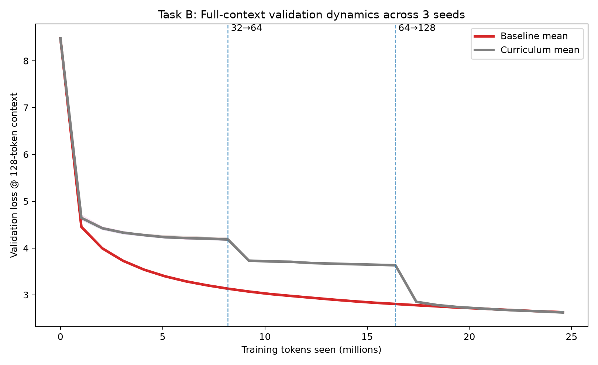
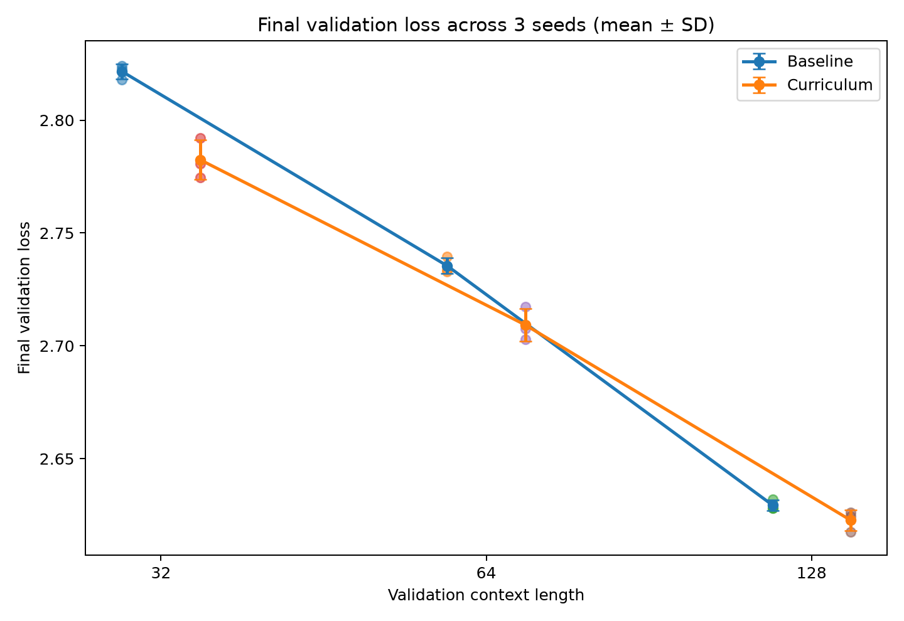
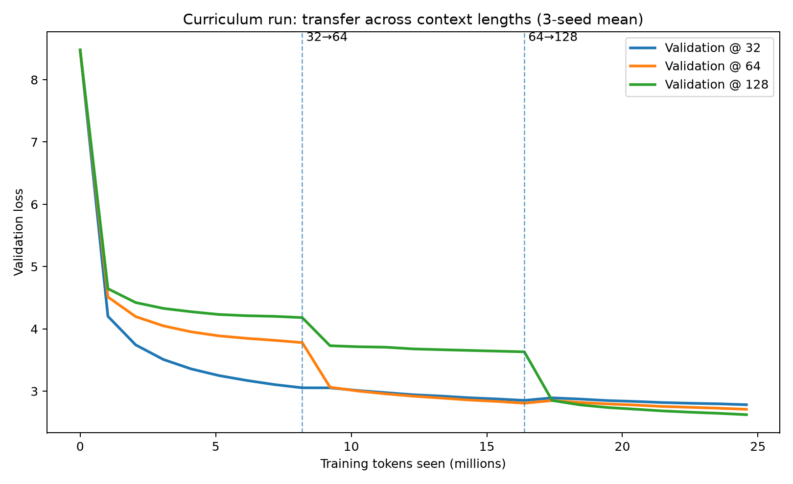

# Task B — 逐步增加 Context Length，会改变一个小语言模型的学习方式吗？

## 研究问题

做完 Task A 以后，我已经基本能够把一个小语言模型从头到尾的训练逻辑讲清楚了。但我还有一个更模糊的问题：**模型看到训练任务的顺序，会不会改变它学习的方式？**

所以我把 Task B 的问题定成：

> **训练时逐步增加 context length，是否会比从一开始就使用完整 context，让一个小 Transformer 学得更高效，或者最终取得更好的 validation performance？**

我比较了两种训练方式：

- **Baseline：** 从头到尾 context length 都是 128
- **Curriculum：** 32 → 64 → 128

我最初的 hypothesis 并不是“curriculum 一定会赢”。我的直觉是，短 context 可能让模型前期更容易学到局部语法和短距离关系，但我不确定这个优势在两个模型都充分训练到 128-token context 以后还会不会存在。

所以我真正想验证的是：

> **Curriculum 可能更多地改变模型“怎么学”，而不是明显改变模型最后“能学到哪里”。**

## 实验设计

我沿用了 Task A 里的同一个模型：4 层 autoregressive Transformer，约 5.29M 参数，hidden size 256，4 个 attention heads，4,096-token BPE vocabulary，最大 context length 128。训练数据是 TinyStories，optimizer 是 AdamW，learning rate 为 `3e-4`，硬件是 Apple M4 + PyTorch MPS。

在每一对 baseline / curriculum 对比里，我固定模型结构、tokenizer、数据集、optimizer、learning rate、hardware 和 random seed。

最终 full run 还进一步固定了：

- **总训练 tokens：24,576,000**
- **optimizer updates：6,000 次**
- **每次 optimizer update 对应 4,096 个有效训练 token**

训练 schedule 是：

```text
Baseline:   128 × 6000 updates
Curriculum:  32 × 2000 updates
             64 × 2000 updates
            128 × 2000 updates
```

因为短 context 的每个 microbatch token 更少，我使用 gradient accumulation 保证每一次 optimizer update 都对应同样的 4,096 个训练 token：context 32 时积累 4 个 microbatches，64 时积累 2 个，128 时 1 个就够。

最终实验分别用了 seed `42`、`7` 和 `123`。

## 第一次 Pilot 的结果“好得过头了”

Task B 里我觉得最有价值的一步，其实是第一次 pilot。

我一开始已经控制了 total training tokens，跑出来以后 curriculum 明显比 baseline 好。但后来我发现，我没有控制 optimizer update 次数。

Baseline pilot 只有 600 次更新，而 curriculum 有 1,400 次。因为 context 越短，每一步看到的 token 越少，要达到同样的 token budget 就需要更多 step。

这意味着 curriculum 其实获得了更多修改参数的机会。

所以那个结果有 confound：我无法判断到底是 context curriculum 有用，还是 optimizer 单纯更新得更多。

我重新设计了实验，用 gradient accumulation 同时控制 total tokens 和 optimizer updates。修正之后，curriculum 的优势明显变小了。

但我反而更相信第二次的结果。

## 结果

### 128-token validation 的完整训练轨迹



Baseline 从第一步开始就在训练 128-token context，所以 full-context validation loss 一直稳定下降。

Curriculum 的轨迹完全不同。在 32-token 阶段，它的 128-token validation loss 明显落后；切到 64 以后开始追赶；真正大的变化发生在切换到 128 以后，full-context validation loss 很快下降，并且几乎追平 baseline。

这个结果让我比较确定一件事情：**只训练短 context，并不会让模型“顺便”学会长 context。** 它仍然需要真正看到长序列。

让我意外的是，一旦开始训练 128-token context，它追得非常快。

### 三个 seed 的最终 validation loss



| Validation context | Baseline mean | Curriculum mean | 平均 improvement |
|---|---:|---:|---:|
| 32 | 2.8216 | 2.7825 | 0.0391 |
| 64 | 2.7354 | 2.7093 | 0.0262 |
| 128 | 2.6294 | 2.6227 | 0.0067 |

三个 seed 下，curriculum 在三个 validation context 上的平均 loss 都更低。

但我觉得比“curriculum 全部赢了”更重要的是：**context 越长，这个优势越小。**

32-token validation 上差别最明显，64 上仍然存在，到了 128，平均只差 `0.0067`。

所以我不会把这个实验总结成“Curriculum 显著提高了模型最终的 long-context 能力”。这个结论太强。

更准确的是：它在 shorter contexts 上留下了比较稳定的优势，但到了最终 full context，两个模型已经非常接近。

### Curriculum 在不同 context 之间如何迁移



在 32-token 阶段，val32 下降最快，而 val64 和 val128 明显落后。

切换到 64 tokens 后，val64 出现比较明显的改善；再切换到 128 后，val128 也快速下降。

这个过程给我的感觉不是“模型在 32 tokens 上把所有东西学完，然后简单复制到 128”。更像是它先把局部结构学扎实，然后每增加一档 context，再补上更长距离的关系。

我不会说这张图证明了模型内部一定发生了某个具体机制，但从 training dynamics 来看，**curriculum 确实改变了模型先学什么、后学什么。**

## 我的理解

最后的结果只支持了我一开始 hypothesis 的一部分。

Curriculum 确实明显改变了 training trajectory，而且在短 context 上保留了比较稳定的最终优势。

但到了最终 128-token context，优势很小：

```text
Baseline:   2.6294
Curriculum: 2.6227
```

所以我现在最愿意 defend 的结论不是“context curriculum 让模型强很多”，而是：

> **Context-length curriculum 改变学习路径的程度，远大于它改变最终 long-context endpoint 的程度。**

如果我只看 final loss，我可能会觉得 curriculum 没什么意思；如果我只看前半段，我又可能会误以为 curriculum 在 long context 上很差。只有看完整的 curve，结果才真正有意思。

## 局限

这个实验的模型很小，只有约 5.29M 参数，最大 context length 也只有 128。所以我不会直接把这个结果推广到现代 long-context language models。

我也只测试了一种 curriculum：`32 → 64 → 128`，而且只跑了三个 random seeds。三个 seed 已经足够让我看到效果方向比较稳定，但还不足以精确估计 128-token 上这么小的 effect size。

另外，我们现在看到 curriculum 会改变 learning dynamics，但还不知道它为什么有效。可能和 early optimization 难度、gradient statistics、positional relationship 的分布有关，也可能是几种因素同时发生。这需要下一组不同的实验才能拆开。

## 结论

我一开始的问题很简单：一个模型是不是应该从第一天就学习完整 context，还是可以先学短的，再慢慢增加难度？

最后得到的答案没有我想象中那么二元。

Curriculum 在三个 random seeds 下最终 validation loss 都略低，尤其是在 32 和 64-token context 上。但到了最终 128-token performance，两者已经非常接近。

真正明显的区别出现在：**模型是怎么走到终点的。**

Curriculum 在没有接触长 context 时确实明显落后，但每次 context 扩大以后，它都会快速适应。

如果让我选这次 Task B 里我学到最重要的一件事，其实不是这个结果，而是第一次 pilot。

第一次的效果更大、更漂亮、更容易讲，但里面有一个我没控制住的变量。修正以后，结果没那么“惊艳”了，却更可信。

我觉得我真正开始理解 research 的地方，恰恰是我愿意放弃那个更漂亮的结果。
